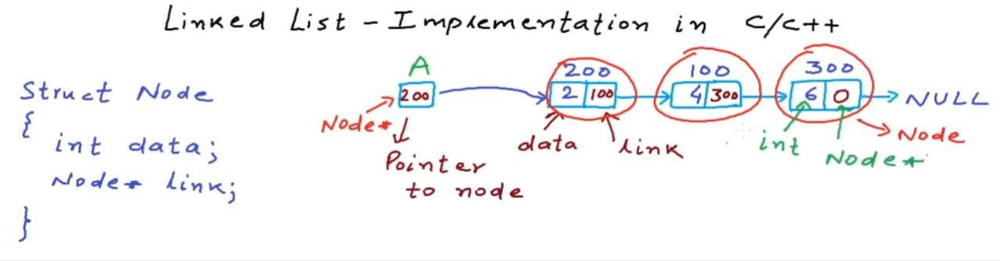

# Linked List Insertion

## What is a Linked List?
A linked list is a linear data structure where elements are stored in separate objects called nodes. Each node contains two parts:
1. **Data**: The actual value being stored
2. **Next pointer**: A reference to the next node in the sequence



## Node Structure
A typical node in a linked list is defined as:

```c
struct Node {
    int data;       // The value stored in the node
    struct Node *next;  // Pointer to the next node
};
```

## Types of Insertion in Linked Lists

There are three main types of insertion operations in a linked list:

1. **Insertion at the beginning**
2. **Insertion at the end** 
3. **Insertion at a specific position**

## 1. Insertion at the Beginning

To insert a node at the beginning of a linked list:

1. Create a new node
2. Set the data value of the new node
3. Point the new node's next pointer to the current head
4. Update the head to point to the new node

```c
void insertAtBeginning(struct Node **head, int value) {
    // Create a new node
    struct Node *newNode = (struct Node *)malloc(sizeof(struct Node));
    
    // Set the data
    newNode->data = value;
    
    // Point new node to the current head
    newNode->next = *head;
    
    // Update head to point to the new node
    *head = newNode;
}
```

## 2. Insertion at the End

To insert a node at the end of a linked list:

1. Create a new node
2. Set the data value and make its next pointer NULL
3. If the list is empty, make the new node the head
4. Otherwise, traverse to the end and link the last node to the new node

```c
void insertAtEnd(struct Node **head, int value) {
    // Create a new node
    struct Node *newNode = (struct Node *)malloc(sizeof(struct Node));
    newNode->data = value;
    newNode->next = NULL;  // New node will be the last node
    
    // If list is empty, new node becomes the head
    if (*head == NULL) {
        *head = newNode;
        return;
    }
    
    // Find the last node
    struct Node *last = *head;
    while (last->next != NULL) {
        last = last->next;
    }
    
    // Link the last node to the new node
    last->next = newNode;
}
```

## 3. Insertion at a Specific Position

To insert a node at a specific position:

1. Create a new node and set its data value
2. Traverse to the node just before the desired position
3. Link the new node to the node after the insertion point
4. Link the node before the insertion point to the new node

```c
void insertAtPosition(struct Node **head, int value, int position) {
    // If position is 0, insert at the beginning
    if (position == 0) {
        insertAtBeginning(head, value);
        return;
    }
    
    // Create a new node
    struct Node *newNode = (struct Node *)malloc(sizeof(struct Node));
    newNode->data = value;
    
    // Find the node before the position
    struct Node *current = *head;
    for (int i = 0; i < position - 1 && current != NULL; i++) {
        current = current->next;
    }
    
    // If position is beyond the end of the list
    if (current == NULL) {
        printf("Position out of range\n");
        free(newNode);
        return;
    }
    
    // Link the new node to the node after the insertion point
    newNode->next = current->next;
    
    // Link the node before the insertion point to the new node
    current->next = newNode;
}
```

## Why Use Double Pointers (`struct Node **head`)?

In C, when we need to modify the original pointer (such as the head pointer), we use a double pointer:

- `struct Node` is the data structure representing a node
- `struct Node *` is a pointer to a node (how we reference a node)
- `struct Node **` is a pointer to a pointer to a node

Double pointers are necessary when:
- We need to modify the original pointer variable, not just what it points to
- The head pointer itself needs to change (like when inserting into an empty list)

Without double pointers, changes to the head pointer would only be local to the function and wouldn't persist once the function returns.

## Basic Operations Example

```c
int main() {
    struct Node *head = NULL;  // Start with an empty list
    
    // Insert nodes
    insertAtEnd(&head, 10);
    insertAtBeginning(&head, 5);
    insertAtPosition(&head, 7, 1);
    
    // List now contains: 5 -> 7 -> 10
    
    return 0;
}
```

## Time Complexity

- **Insertion at beginning**: O(1) - constant time
- **Insertion at end**: O(n) - where n is the number of nodes
- **Insertion at position**: O(n) - in worst case

## Memory Management

Always remember to:
1. Allocate memory for new nodes using `malloc()` in C or `new` in C++
2. Free memory when nodes are deleted to prevent memory leaks